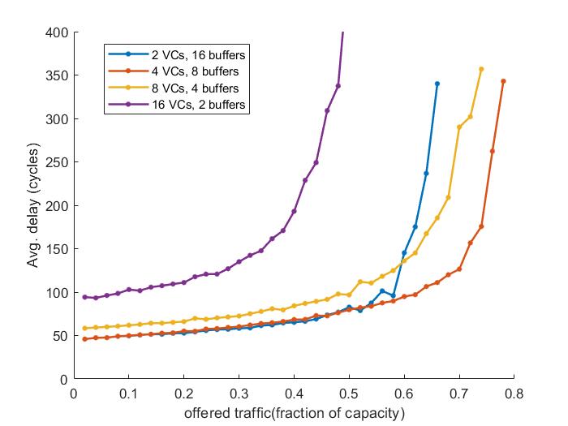

# IL2236_project

## 1. What problems you can detect from this setup? Why?

Input count&timing shoud be set before the source queue buffer because the waiting time for buffer to enter the network should be considered.

## 2. (Performance evaluation) Answer the following questions:

**a) Explain the differences of open-loop and closed-loop measurements.**

**The open-loop measurement** configuration enables the traffic parameters to be controlled independently of the network itself:

1. Use an infinite source queue for the traffic isolation. This separates the packet source from the network at each terminal
2. The source queues are not part of the network being simulated, but serve to isolate the traffic processes from the network itself.
3. The goal is generally to evaluate the network on a specific traffic pattern for throughput, latency, and fault tolerance.

**Closed-loop measurement systems**, in which the network influences the traffic, are useful for measuring overall system performance:

1. For example, the performance of a multicomputer may be estimated by running a simulation in which the terminal instrumentation is replaced by simulations of the multicomputer’s processors.
2. A more typical application of this simulation setup would be to test the sensitivity of the application run time to network parameters such as bandwidths, routing algorithms, and flow control.

**b) Explain why, in the open-loop measurement, during the drain phase, we need to run the
network long enough for all of the measurement packets to reach their destination?**

It is important that the simulation be run long enough to measure
the finish time of every measurement packet to capture the tail of the
latency distribution.

**c) Explain the throughput bounds in a general network as shown in the latency vs. offered traffic
graph, specifically, why the Topology bound is larger than the routing bound, which is larger
than the saturation throughput.**

Topology throughput bound is ideal, assuming
random traffic with perfect flow control (no idle
cycles for channels) and perfect routing (load
balance, minimal path); Routing throughput bound counts possible load imbalance of a routing algorithm; Saturation throughput counts idle channels
due to resource dependencies (VC allocation
dependency for deadlock freedom, credit
availability etc.). So the Topology bound is larger than the routing bound, which is larger
than the saturation throughput.

## 3. Simulator and Simulation
### A. The experimental setup
**1. Study Chapter 19 Allocation, in particular, 19.3 on iSLIP allocation algorithm. Explain
how iSLIP algorithm works.**

iSLIP is a separable allocation method that uses round-robin arbiters and updates
the priority of each arbiter only when that arbiter generates a winning grant. iSLIP can
be used either in a single pass, or as an iterative matching algorithm. By rotating the
winning arbiters, iSLIP acts to stagger the priority of the input arbiters, resulting in
fewer conflicts at the output stage. The update of a priority only occurs when an
arbitration results in a grant and, as in a round-robin arbiter, priorities are updated
so that a winning request has the lowest priority in the next round.

**2. Study the four rouging algorithms: DOR standing for dimension-order routing, ROMM
for randomized minimal algorithm, VAL for Valiant’s randomized algorithm, and MAD
for minimal-adaptive routing algorithm. Explain the routing algorithms, namely, DOR,
ROMM, VAL and MAD.**

**DOR standing for dimension-order routing algorithm:** the digits of
the destination address, interpreted as a radix-k number, are used one at a time to
direct the routing. Rather than selecting an output port at a given stage, however,
each digit is used to select a node in a given dimension. for example, consider a 2-D mesh. Within the first dimension x,
a packet traveling in the +x direction can only wait on a channel in the +x, +y, and
−y directions. Similarly, an −x packet waits only on the −x, +y, and −y directions.
In the second dimension, a +y packet can only wait on other +y channels and a −y
packet waits only on −y. 

**ROMM for randomized minimal algorithm:** attempts to achieve the load balance of randomized rout-
ing without giving up the locality by restricting routes to be minimal (shortest path)

**VAL for Valiant’s randomized algorithm:** load can be balanced for any traffic pattern on almost any topology 1 using Valiant’s
algorithm, in which a packet sent from s to d is first sent from s to a randomly
chosen intermediate terminal node x and then from x to d.
While a non-minimal oblivious routing algorithm may choose any path in $R'_{xy}$ to 
route a packet from x to y, minimal oblivious routing restricts its choice to paths in
$R_{xy}$ . For hierarchical topologies, minimal oblivious routing works extremely well --
it gives good load balance while preserving locality.

**MAD for minimal-adaptive routing algorithm:**  chooses among the minimal routes from
source s to destination d. At each hop a routing function
generates a productive output
vector that identifies which
output channels of the current
node will move the packet
closer to its destination. Network state is then used to
select one of these channels
for the next hop. It is good at locally balancing load but poor at globally balancing
load.

### B. Section 25.1, Routing experiments:

**1. Validate the latency performance of the four algorithms by re-producing at least two of
the five figures, namely, Figure 25.1 and 25.2. 25.3, 25.4, and 25.5.**

**2. Validate the throughput performance by re-producing Figure 23.2**

### C. Section 25.2, Flow control experiments:

**1. Understand the impact of virtual channel partitionings on network performance by re-
producing Figure 25.7**

Ramping up the count of virtual channels will lead to an elevation in both the allocation time for virtual channels and the throughput in pipelines. As an outcome, the latency beneath saturation tends to escalate with the growth in the number of virtual channels. 

Evidently, in the instance of 16 virtual channels and 2 buffers, there's a distinct zero-load latency. This anomaly stems from our router model incorporating pipelining latencies, causing the buffer's credit loop latency to exceed a single cycle. If the buffer depth isn't large enough to accommodate this latency, the virtual channel's utilization will not peak at 100%, resulting in a stall as it awaits credits.

**2. Understand the impact of network size on network performance by re-producing Figure
25.8**

**3. Understand the impact of injection processes on network performance by re- producing
Figure 25.9**

## 4. (Simulation with BookSim) 

**A. (Queuing latency vs. network latency) simulate a 6x6 mesh network, a 6x6 torus network.
Draw average latency vs. offered traffic graphs, one with queuing latency, and the other
without queuing latency.**

**B. (Latency histogram) Draw latency histogram when offered traffic is at 30% of network
capacity for the simulations in A). Please note that the maximum offered traffic is equivalent
to ideal throughput which you can calculate.**

**C. (Latency distribution) Draw per-node average latency as bar diagram (one bar for one node)
for the 6x6 mesh and 6x6 torus networks in A).**

**D. (Throughput distribution) Draw per-node throughput as bar diagram (one bar for one node)
for the 6x6 mesh and 6x6 torus networks in A).**

